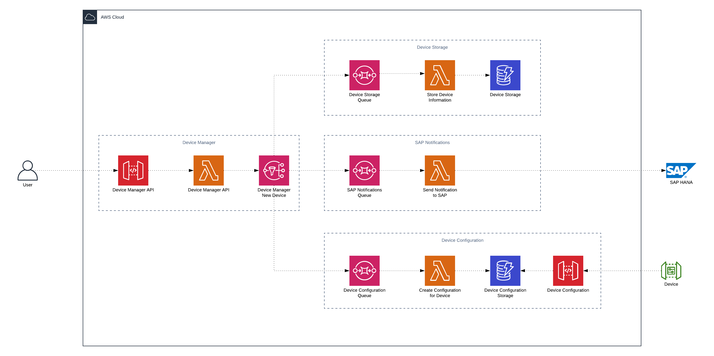

# DEVICE MANAGER

We will learn by doing and how to build a serverless application for device managing. You will use services like AWS LAMBDA, AMAZON API GATEWAY, AMAZON DYNAMODB, AMAZON SQS, AMAZON SNS

## ARCHITECTURE

